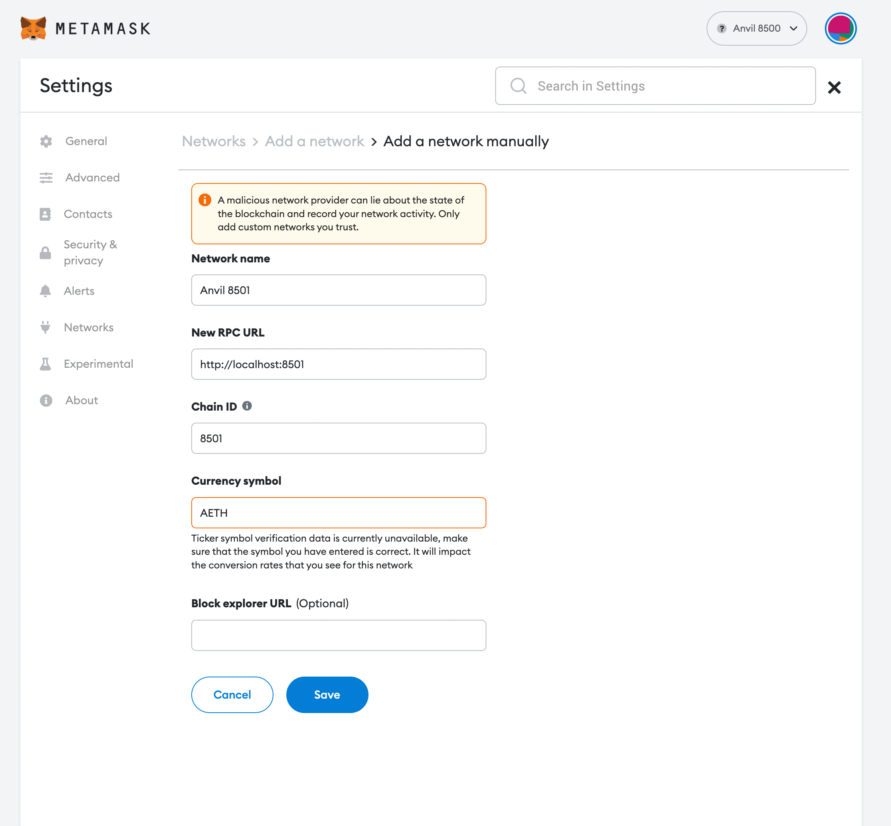

# Contracts

## Source

This was taken from https://github.com/a16z/eth-testnet-drop and modified to work with the new drop to poap token holders.
Thanks to the team at a16z for the original work, I could not have done it without them!

## Deployments

- Goerli: `0xc638f625aC0369d56D55106affbD5b83872Db971`

## Compile

`npx hardhat compile`

## Test

`npx hardhat test`

## Collect using CLI

_Ideally use the UI for collection, but if you'd like to use cmd, run the command below._

`ts-node ./scripts/collect.ts --pk=<collection private key> --rpc=<rpc for relevant chain> --contract_address=<Collector contract address> --leaves_file=<Merkle tree leaves file path>`

## Deploy (using gcloud KMS)

1. Set up environment variables for:
   - `ALCHEMY_API_KEY`
   - `GOOGLE_APPLICATION_CREDENTIALS` ([details](https://cloud.google.com/docs/authentication/application-default-credentials#GAC))
   - `KMS_PROJECT_ID`
   - `KMS_LOCATION_ID`
   - `KMS_KEYRING_ID`
   - `KMS_KEY_ID`
   - `KMS_KEY_VERSION`
2. `ts-node ./scripts/deploy-kms.ts --network=goerli --amount=10000000000 --leaves_file=./data/mt.txt`

There are two optional cmd flags: `graffiti` / `recipient`

## Deploy (using local private key)

`npx ts-node scripts/deploy-goerlinator.ts --network=goerli --amount="50.0" --leaves_file=data/poapHoldersBefore2023-03-01.csv`

## Dev workflow (UI testing)

1. Set up environment variable for `DEV_WALLETS` (comma separated list of public keys)
2. Fill out `local-mt.txt` with some public keys for claiming
3. Add `Anvil 8500` and `Anvil 8501` networks to wallet
4. `yarn start-local` – spins up 2 anvil nodes at 8500 and 8501 for testing dual network.

## metamask local net setup

## Generate tree

- `ts-node ./scripts/generate-tree`
